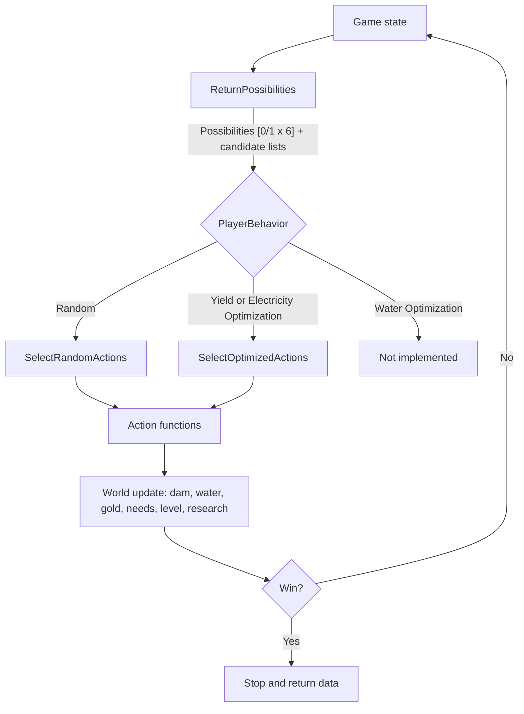

# DegrowthPythonSimulation

A balance simulator for the dam management game, Degrowth. A simulated player runs a hydroelectric dam (pipes, turbines, generators) that must power a city whose electricity needs grow over time. The simulator plays the game automatically, one decision per second, so that the economy, progression and pacing can be tuned from data instead of by hand.

The project has three layers:

1. **Simulation core** (`simulation_functions.py`): the game state, the rules, and the simulated player.
2. **Launcher** (`launchSimulation.py`): injects parameters into the core, runs it, and saves the results.
3. **Tooling** (`frontend.py`, `visualization.py`): a NiceGUI front end to edit parameters and plot results, and a matplotlib alternative.

The module catalog (`modules_data.py`) is data only and is not documented here. See [What the core expects from `modules_data.py`](#what-the-core-expects-from-modules_datapy).

---

## Quick start

Requirements: **Python 3.12 or later** (the code uses `match` statements and nested same-quote f-strings, which need 3.12).

```
pip install numpy pandas matplotlib nicegui
pip install pywin32        # Windows only, used by local_file_picker.py
```

Run everything from the `DegrowthPythonSimulation/DegrowthPythonSimulation` folder, because file paths are relative.

| Goal | Command |
|---|---|
| Edit parameters, run, and see charts in a browser | `python frontend.py` |
| Run headless with the parameters in `newParameters.json` | `python launchSimulation.py` |

A headless run prints a tick-by-tick log to the console and writes the result series to `data.json`.

---

## Repository layout

```
README.md
DegrowthPythonSimulation/
  simulation_functions.py   Simulation core: state, possibilities, choice, actions, tick loop
  modules_data.py           Module catalog (Modules, AllModules, Sections, enums). Data only.
  launchSimulation.py       Reads newParameters.json, configures the core, runs it, writes data.json
  newParameters.json        Parameters saved by the front end, consumed by the launcher
  defaultParameters.py      Hard-coded default parameters (same shape as the launcher), used by the front end to prefill fields
  frontend.py               NiceGUI app: parameter form, Launch button, ECharts dashboards
  visualization.py          matplotlib/pandas graphs (show_graphs), used by the launcher
  data.json                 Output of the last run (generated, large)
  backup.py                 NiceGUI scratch file (tabs, drawer, file picker, echart update demo). Not part of the app.
  local_file_picker.py      NiceGUI file picker dialog, only used by backup.py
```

---

## Simulation architecture

### The mental model

The simulation is a fixed-step loop. **One tick is one simulated second**, and the player makes **at most one decision per tick**. A run lasts `SimulationDuration * 60` ticks, or stops earlier on a win.

Each tick follows the same pipeline:

```
 Game state
     |
     v
 1. POSSIBILITIES    ReturnPossibilities()     What is the player allowed to do right now?
     |
     v
 2. CHOICE           SelectRandomActions()     Which possibility does the player pick, and with what target?
                     SelectOptimizedActions()
     |
     v
 3. ACTION           PlaceModule / BuySpot / UpgradeModule / UnlockModule / investSearch / SellModule
     |                                         Mutates the dam, the gold, the research.
     v
 4. WORLD UPDATE     dam, water, gold, needs, city level, research progress
     |
     v
 5. END CHECK        win condition, then logging and data recording
```

The separation matters: **possibilities** are pure queries on the state (they depend on the behavior only to filter and rank candidates), **choice** is the player policy, and **actions** are the only functions that change the player's assets.



### Game state

The state is held in **module-level globals of `simulation_functions`** (imported as `sf`). The launcher overwrites them before calling `sf.run()`. There is no state object, so a run mutates the module: do not call `run()` twice in the same process without resetting the globals.

| Group | Variables | Meaning |
|---|---|---|
| Dam | `Dam` | List of 3 sections: index 0 = pipes (`Canalisations`), 1 = turbines, 2 = generators. Each section is a list of spots; a spot is a module name or `""` when empty. Starts as `[["CTI//", ""], ["TTI//", ""], ["GTI//", ""]]`. |
| Dam growth | `SpotPrices`, `SpotCityLevels`, `InitialSectionLength` | The n-th extra spot of a section costs `SpotPrices[n]` and needs city level `SpotCityLevels[n]`. `InitialSectionLength` is recomputed from `Dam[0]` at the start of `run()`. |
| Module pool | `Modules`, `AllModules` (from `modules_data`) | `Modules` = modules the player has unlocked and can buy. `AllModules` = locked pool that research draws from. Unlocking moves entries from `AllModules` to `Modules`. |
| Economy | `CurrentGold` | Player currency. Income comes from the city level. |
| Electricity | `CurrentElectricity`, `BoostElectricityOutput` | Output of the generator section, recomputed every tick. |
| Water | `WaterSupply`, `MaxWaterSupply`, `WaterRegen`, `WaterBalance`, `BoostWaterConsumption`, `IsWaterPoolInfinite` | Lake reserve and its per-second balance. |
| City | `CurrentCityLevel`, `CityLevels`, `CurrentNeeds`, `TargetNeeds`, `TargetTime`, `SpeedCoeffA/B` | `CityLevels[l]` holds `NextLevelElectricity`, `GoldGeneration`, `ResearchSpeed`. Needs follow a curve over time. |
| Research | `progressBar`, `distance`, `speed`, `searchCounter`, `totalSearchCounter`, `nbSearchProposed`, `dropRate`, `speedCityLevel`, `eachPriceInvest`, `priceInvest` | A bar that fills over time. Each completion grants one unlock token (`searchCounter`). |
| Player memory | `PlayerBehaviorIndex`, `PlayerPriceTolerance`, `PlayerChoice`, `IsPlayerSaving`, `DesiredBuyModule`, `DesiredUpgradeLocation`, `PlayerAction` | The policy and its short-term intent (see [Choice](#choice-the-player-policy)). |
| Run status | `GameStates`, `CurrentGameState`, `GamePhases`, `CurrentGamePhase`, `GamePhasesTimes`, `CityLevelsTimes`, `NextCityLevel`, `RequiredCityLevelToWin` | Win/defeat state, plus bookkeeping for the duration charts. |

### Possibilities

`ReturnPossibilities()` evaluates every action type and returns:

```
Possibilities, BuyableModules, BuyableSpots, UpgradableModules,
UnlockableModule, InvestSearch, SoldableModules
```

`Possibilities` is a **vector of six flags** (1 = available, 0 = not). The index is the action id used everywhere else.

| Index | Action | Available when | Candidates returned by | Candidate shape |
|---|---|---|---|---|
| 0 | Place a module | A section has a free spot and an unlocked module of that section is affordable | `CheckBuyPossibilities()` | list of module names |
| 1 | Buy a spot | A section is below its max length, `SpotPrices[tier] <= CurrentGold`, and `CurrentCityLevel >= SpotCityLevels[tier]` | `CheckBuySpots()` | list of section names |
| 2 | Upgrade a module | A placed module has a valid `upgradeName` present in `Modules` and `upgradeCost` is affordable | `CheckUpgradableModules()` | list of `[section_index, spot_index]` |
| 3 | Unlock a module | `searchCounter > 0` and `AllModules` is not empty | `checkUnlockModule()` | bool |
| 4 | Invest in research | `CurrentGold >= priceInvest` | `checkInvest()` | bool |
| 5 | Sell and replace | A placed module has a strictly better candidate in the same section that `CurrentGold + sellPrice` can pay for | `CheckSellPossibilities()` | dict `{(section, spot): candidate(s)}` |

**Behavior changes what a candidate is.** The three implemented behaviors share the same structure but filter and rank differently:

| Behavior | Affordability test (buy, upgrade) | Ranking among candidates | "Better module" test (sell) |
|---|---|---|---|
| `Random` | `cost <= CurrentGold` for buy, any affordable upgrade | None, all candidates kept | Higher `tier` in the same section |
| `Yield Optimization` | `cost * PlayerPriceTolerance <= CurrentGold` | Best `yield` per section (one candidate per section) | Higher `yield` |
| `Electricity Optimization` | `cost * PlayerPriceTolerance <= CurrentGold` | Best `maximumInput * yield` per section | Higher `maximumInput * yield` |

`PlayerPriceTolerance` (0 to 1) lets the optimizing player target a module slightly above their current gold. The cost test is `cost * tolerance <= gold`: with `0.9`, a module becomes a candidate once the player holds 90% of its price, and the player then **saves** the remaining gold before buying (see below).

### Choice: the player policy

Two policies exist, selected by `PlayerBehaviors[PlayerBehaviorIndex]`:

| Index | Name | Implementation |
|---|---|---|
| 0 | `Random` | `SelectRandomActions` |
| 1 | `Yield Optimization` | `SelectOptimizedActions` |
| 2 | `Electricity Optimization` | `SelectOptimizedActions` |
| 3 | `Water Optimization` | Not implemented (prints a message, the player does nothing) |

**`SelectRandomActions`** draws a random index in `0..5` until it lands on an available possibility, then performs that action on a random candidate. If nothing is available, the player does nothing this tick.

**`SelectOptimizedActions`** is the same draw, plus a small **intent and saving mechanism**, which is what makes it behave like a planner:

1. Draw an action index (unless the player is already saving, in which case the previous index is kept).
2. For *Place a module*: pick a target module (`DesiredBuyModule`). If it costs more than `CurrentGold`, set `IsPlayerSaving = True` and wait; the same action index is retried each tick until the gold is there, then the module is placed and the intent is cleared.
3. For *Upgrade a module*: same logic with `DesiredUpgradeLocation`.
4. Other actions execute immediately.

The only difference between `Yield Optimization` and `Electricity Optimization` is therefore **the metric used in the `Check*` filters and in `UnlockModule`**, not the policy code.

Every tick, the human-readable result is stored in `PlayerAction` (for example `"Saved to buy X | Gold remaining : n"`), which is what the console log prints.

### Actions

All actions are plain functions that return the new gold amount (except research ones that use globals). They assume the possibility check has already passed.

| Function | Effect on state | Gold |
|---|---|---|
| `PlaceModule(module, gold)` | Puts `module` in the first free spot of its section | `- buyCost` |
| `BuySpot(section, gold)` | Appends one empty spot to the section | `- SpotPrices[tier]` |
| `UpgradeModule(location, gold)` | Replaces the module at `location` by its `upgradeName` | `- upgradeCost` |
| `SellModule(location, gold)` | Empties the spot | `+ sellPrice` |
| `UnlockModule()` | Spends one `searchCounter` token: draws `nbSearchProposed` modules from `AllModules`, the behavior picks one, and it is moved to `Modules` together with the modules listed in its `parent` field | none |
| `investSearch()` | Adds `speed` to `progressBar` immediately | `- eachPriceInvest[totalSearchCounter]` (clamped to the last entry) |

**Unlock draw.** Candidates are weighted by `dropRate = [P(x), P(x-1), P(x-2)]` according to the module `cityLevel` relative to `CurrentCityLevel`; weights are normalized and sampled without replacement by `numpy`. `Random` picks one of the proposed modules at random, the optimizers take the best by their metric.

**Sell and replace** is one composite choice (index 5): sell the module at a location, then place the candidate returned for that location.

### World update (every tick, after the action)

| Subsystem | Rule |
|---|---|
| Dam | `UpdateDam()` chains the three sections. Pipes output `sum(round10(maximumInput * yield))`. That flow is split equally among turbines, each capped at its `maximumInput`, and each outputs `round10(input * yield)`. The same split-and-cap applies from turbines to generators. `CurrentElectricity` is the generator total times `BoostElectricityOutput`. |
| Water | `WaterSupply -= ComputeTotalWaterConsumption()` (sum of pipe `maximumInput` times `BoostWaterConsumption`), then regenerates by `WaterRegen`, capped at `MaxWaterSupply`. `WaterBalance = WaterRegen - consumption`. |
| Gold | Every `GoldUpdateRate` ticks: `CurrentGold += CityLevels[level]["GoldGeneration"]`. |
| Needs | Every `CityUpdateRate` ticks: `CurrentNeeds = TargetNeeds * r^A * (1 - (1 - r)^B)` with `r = time / TargetTime`, `A = SpeedCoeffA` (slope at the start), `B = SpeedCoeffB` (slope at the end). |
| City level | If `CurrentElectricity >= CityLevels[level]["NextLevelElectricity"]` the level increases by 1 (at most once per tick). Level 10 has `NextLevelElectricity = 0` and is the cap. |
| Research | `speed` = `speedCityLevel[level - 1]` (last entry if the level is beyond the list). `progressBar += speed`. When `progressBar >= distance`: reset the bar, `searchCounter += 1`, `totalSearchCounter += 1`, and `distance += 10` (each research takes longer). |

### End conditions

| State | Condition | Status |
|---|---|---|
| `Won` | `CurrentElectricity > CurrentNeeds` **and** `CurrentCityLevel >= RequiredCityLevelToWin` (8) **and** `WaterBalance > 0` | Active |
| `Defeat, no water` | `WaterSupply < 0` (unless the pool is infinite) | **Commented out**, never triggers |
| `Defeat, not enough electricity` | `CurrentElectricity < CurrentNeeds * (1 - AuthorizedDifferenceWithNeeds)` | **Commented out**, never triggers |
| `Running` | None of the above | Run continues until `SimulationDuration * 60` ticks |

### Output data

`run()` returns a dict, which the launcher dumps to `data.json`. Every series is indexed by tick (`Time`).

| Key | Content |
|---|---|
| `SimulationTimes` | List of ticks that were simulated |
| `CityLevelsData` | `Level`, `Time` |
| `ElectricityOverTimeData` | `Electricity`, `Time` |
| `NeedsOverTimeData` | `Needs`, `Time` |
| `SearchOverTime` | `Search` (total researches completed), `Speed`, `Time` |
| `WaterOverTime` | `WaterSupply`, `WaterBalance`, `WaterConsumption`, `Time` |
| `CityLevelsTimes` | Tick at which each city level was reached (durations are derived with `ComputeDurationsFromTimes`) |
| `GamePhasesTimes` | Ticks at which the game switched between `Playing` and `Nothing` (`Nothing` = dam fully built and fully upgraded) |

### What the core expects from `modules_data.py`

`simulation_functions.py` imports `Sections, Type, Tier, Resistance, CityLevel, AllModules, Modules`. From how the core uses a module entry, each one must provide these fields:

`section`, `tier`, `buyCost`, `sellPrice`, `upgradeCost`, `upgradeName` (empty string when there is no upgrade), `yield`, `maximumInput`, `cityLevel`, `parent`.

`Sections` must list the sections in dam order (pipes, turbines, generators), because the dam logic indexes `Dam[0]`, `Dam[1]`, `Dam[2]` directly.

---

## Configuration

### How parameters flow

```
frontend.py form  --Save Parameters-->  newParameters.json  --read by-->  launchSimulation.py  -->  sf.* globals  -->  sf.run()
                                                                                                                      |
frontend.py charts  <--load_graph--  data.json  <--------------------------------------------------------------------+
```

`defaultParameters.py` is **not** read by the launcher. It is a hard-coded twin of the launcher that the front end imports only to prefill its form. Changing a default there does not change what the launcher runs.

### Parameters exposed in `newParameters.json`

| Key | Sets | Notes |
|---|---|---|
| `BehaviorSelector` | `PlayerBehaviorIndex` | `Random`, `Yield Optimization`, `Electricity Optimization` (the UI does not offer `Water Optimization`) |
| `SimulationDuration` | run length in minutes | |
| `PlayerPriceTolerance` | `PlayerPriceTolerance` | 0 to 1 |
| `WaterSupply`, `MaxWaterSupply`, `WaterRegen` | lake | |
| `SpotPrices`, `SpotCityLevels` | dam growth | Lists, must have the same length |
| `BoostElectricityOutput`, `BoostWaterConsumption` | multipliers | |
| `CurrentNeeds`, `TargetNeeds`, `TargetTime`, `SpeedCoeffA`, `SpeedCoeffB` | needs curve | |
| `Distance` | initial research distance | |
| `DropRate`, `SpeedCityLevel`, `EachPriceInvest` | research | |
| `CurrentElectricity`, `InitialSectionLength` | **ignored** by the launcher | The launcher hard-codes the starting electricity (10) and the dam layout; `InitialSectionLength` is recomputed in `run()` |

### Parameters hard-coded in `launchSimulation.py`

Not editable from the UI: the starting `Dam` layout, the whole `CityLevels` table (level thresholds, gold generation, research speed), `GoldUpdateRate`, `CityUpdateRate`, `RequiredCityLevelToWin`, `AuthorizedDifferenceWithNeeds`, `IsWaterPoolInfinite`, `nbSearchProposed`, the initial `priceInvest`, and the four `show_*` graph flags (all `False`, so the launcher opens no matplotlib window by default).

---

## Front end and visualization

**`frontend.py`** (NiceGUI, dark theme): a left drawer with the parameter form grouped as Simulation, Lac, Barrage, Ville, Recherche, and four chart tabs:

| Tab | Charts |
|---|---|
| Électricité & Ville | Electricity vs needs, city level over time, duration per city level |
| Barrage & Eau | Water reserve, water consumption |
| Recherche | Research count and speed |
| Phases de Jeu | Duration of each game phase |

The header has **Save Parameters** (writes `newParameters.json`; list fields are parsed with `ast.literal_eval`) and **Launch** (runs `python launchSimulation.py` as a subprocess, then reloads `data.json` into the charts). Launch is blocking: the UI waits for the run to finish.

**`visualization.py`**: `show_graphs(data, showElectricityNeedCityGraphs, showWaterGraphs, showSearchGraph, showGamePhasesGraph)` draws the same charts with matplotlib/pandas. Turn the flags on in `launchSimulation.py` for a headless run with local plots.
